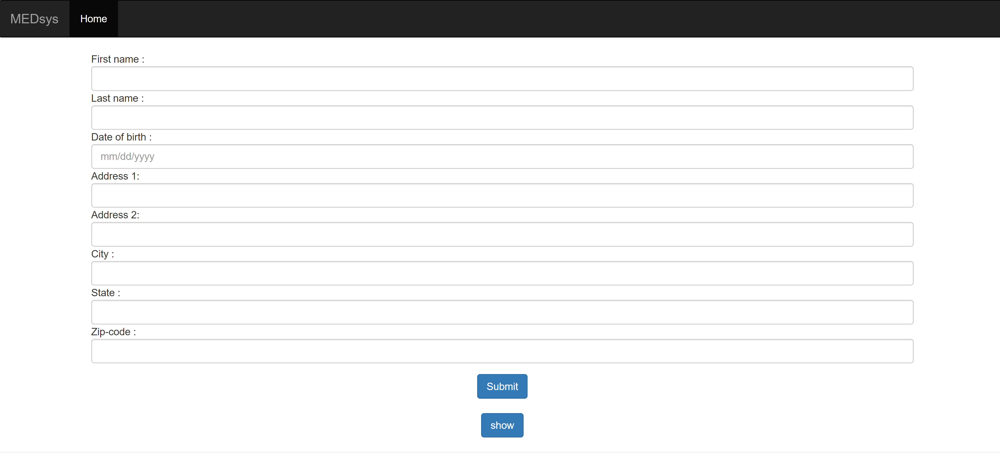
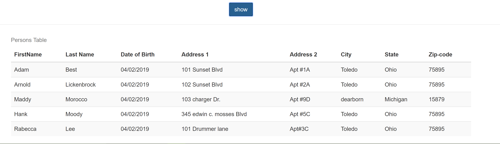
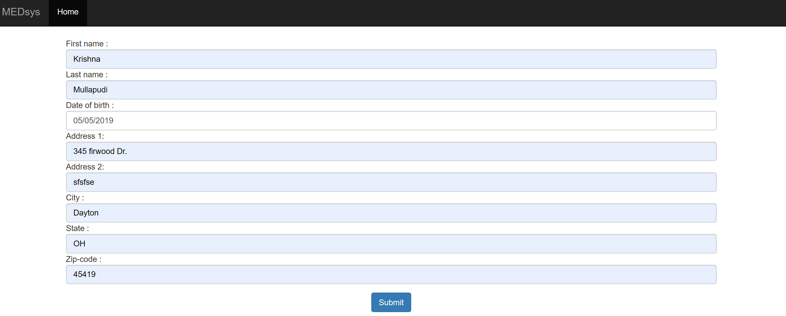
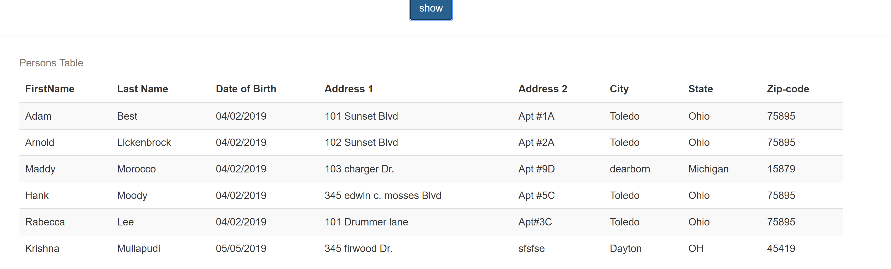

# medsys
## medsys 2nd round project
- This application was developed in java using Spring boot. It is a single page application that consists of forms to input data, a button to store it in the database and another button to render the table.
- I did not use a backend DB instead I stored all the details in a list and retreived it 
- For the view I used jsp.

## ScreenShots of the Project
- home page.

  
- On clicking the show button data from the db is shown in a table and displayed on the bottom of the page.

  
- When the user types in the data and clicks on submit button. The data is stored in the databse

  
- updated table.

  

